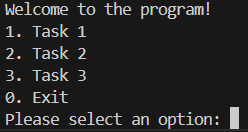
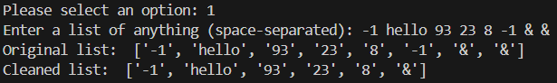
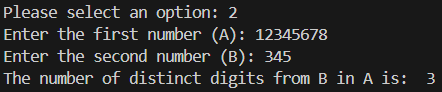
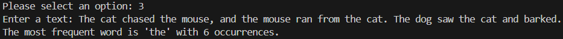

# My control Work

This is a simple console-based Python program with three different tasks accessible via a menu interface:

1. **Remove Duplicates from a List**  
   Input a list of values and get the cleaned version with duplicates removed.
   

2. **Count Distinct Digits from B in A**  
   Enter two non-negative integers A and B. The program will count how many distinct digits from B appear in A.
   

3. **Find Most Frequent Word in a Text**  
   Enter a text string. The program will analyze it and display the most frequently occurring word.
   

